# Test Time Optimization  
## Verilumen Simulation Agent — User Guide

---

### About this guide

This document explains the dashboard in plain language. Each section below matches a part of the screen, with a picture of that area and a short explanation of what it means and how to use it.

The tool helps you compare two ways of running scan patterns:

- **Without verilumen agent** — run every pattern (uses more memory and more test time)  
- **With verilumen agent** — run a smaller, carefully chosen set of patterns (saves memory and test time)

---

### Page overview

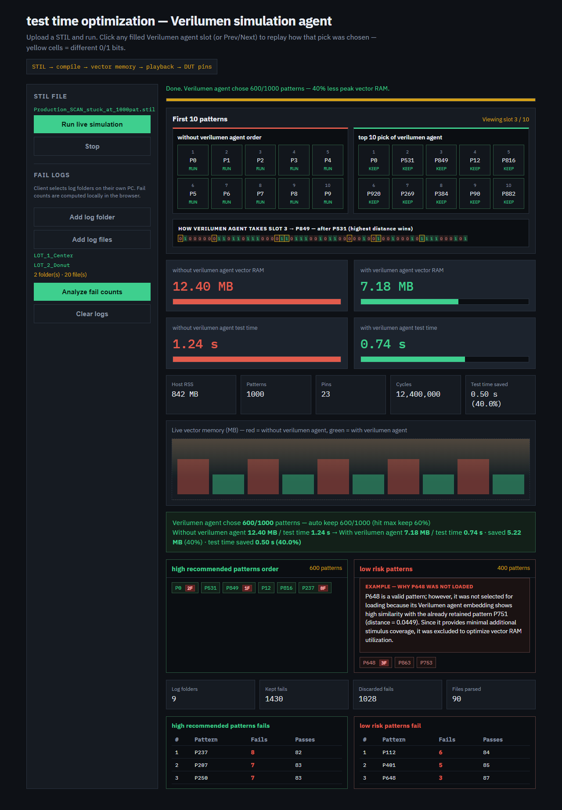

When you open the application, the page is split into two main areas.

On the **left**, you control the workflow: upload a STIL file, start or stop the simulation, and later add fail logs for analysis.

On the **right**, you see live results: how patterns are chosen, how much vector memory is used, how long testing would take, and (after log analysis) how many fails appear in kept and discarded patterns.

---

### Recommended steps

Use the dashboard in this order:

**Step 1.** Upload your STIL file from the left panel.  
**Step 2.** Click **Run live simulation**. **This will take some time to load** — please wait while processing runs. The status line and progress bar show embedding and comparison. Do not continue until the run finishes (status shows **Done**).  
**Step 3.** Review the first ten pattern picks, the memory gauges, and the test-time gauges.  
**Step 4.** Add your fail-log folders from your own computer.  
**Step 5.** Click **Analyze fail counts** for **high recommended patterns order** and **low risk patterns**.

---

## 1. Title and introduction

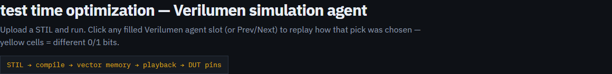

The top of the page shows the product name: **test time optimization — Verilumen simulation agent**.

Under the title is a short instruction line that reminds you to upload a STIL file and run the simulation. You can also click pattern slots later to replay how each pick was decided. Yellow cells in the bit view mark differences between patterns.

The yellow strip underneath shows the high-level flow of ATE testing:

**STIL → compile → vector memory → playback → DUT pins**

In simple terms: the STIL file becomes patterns, patterns are loaded into vector memory, then they are played to the device pins.

---

## 2. Left panel — STIL file and fail logs

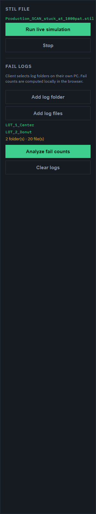

This panel is where you start all work.

### Uploading and running a STIL file

First, upload a STIL file (usually ending in `.stil`). After the file name appears, click **Run live simulation**. **This will take some time to load** — please wait while the agent embeds patterns, compares them, and loads results on the right. Watch the status line and yellow progress bar until the run is **Done** before reviewing gauges or adding fail logs.

If you need to cancel a run that is still in progress, click **Stop**.

### Adding fail logs

After the simulation has finished, you can analyze real tester logs. Use **Add log folder** to select one folder at a time (you can add several folders), or **Add log files** if you only want specific files.

When your folders are listed, click **Analyze fail counts**. The tool counts how many times each pattern failed in those logs, for both:

- patterns the Verilumen agent kept, and  
- patterns it discarded.

**Clear logs** removes the selected logs from the page so you can start a new analysis.

Important: fail analysis runs locally in your browser on your computer. Your log files stay on your PC and are not sent to the server as a large upload. That makes analysis work even when you are using the shared web link.

---

## 3. Status message and progress bar

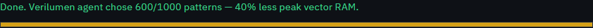

Just above the main results area, the status line tells you what is happening right now — for example, that the agent is embedding patterns, comparing candidates, or that the run is complete.

The thin yellow bar under the status text shows progress. When the bar is full, the main simulation steps are finished.

---

## 4. First ten patterns — without vs top 10 pick of verilumen agent

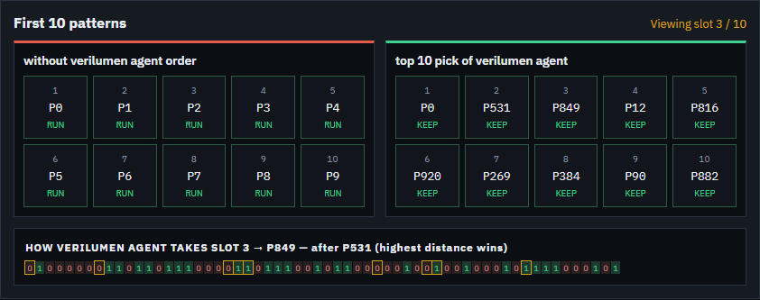

This section is the live “decision window.” It shows the first ten pattern choices so you can see how the Verilumen agent thinks.

### The two boards

On the left, **without verilumen agent order** shows patterns in ordinary order (P0, P1, P2, and so on). Each slot is marked **RUN**, meaning a full-suite tester would simply run the next pattern in sequence.

On the right, **top 10 pick of verilumen agent** shows the patterns the agent selected. These are not in simple numerical order. The agent picks patterns that look different from each other so the smaller set still covers diverse stimulus. Each selected slot is marked **KEEP**.

### Understanding one pick

Below the boards, the page explains the current slot — for example, which pattern was chosen for slot 3, and why (usually because it had the highest distance from patterns already kept).

The row of **0** and **1** bits is a simplified view of the scan chain. Bits outlined in yellow are different from the comparison pattern. You can move through slots with **Prev** / **Next**, or by clicking a filled slot, to replay each decision.

---

## 5. Vector memory (RAM) comparison

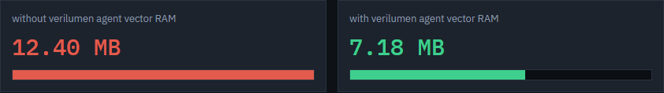

These two cards answer a simple question: *How much vector memory do we need?*

The red card, **without verilumen agent vector RAM**, shows the memory needed if every pattern is loaded.

The green card, **with verilumen agent vector RAM**, shows the memory needed if only the kept patterns are loaded.

When the green value is lower, the agent has reduced the memory footprint. That is the main “vector memory optimization” result.

---

## 6. Test time comparison

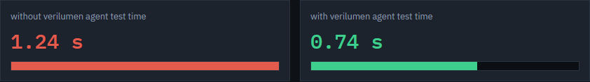

These cards answer a related question: *How long would the test take?*

The red card, **without verilumen agent test time**, shows estimated time for all patterns.

The green card, **with verilumen agent test time**, shows estimated time for the kept subset only.

A lower green value means the reduced pattern set also shortens test time. That is the “test time optimization” result.

---

## 7. Key metrics

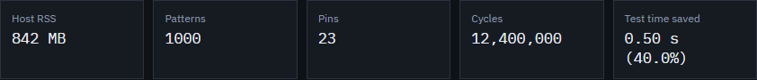

Under the gauges, a row of small cards summarizes important numbers from the STIL and the run:

- **Host RSS** — how much memory the simulation process is using on the machine  
- **Patterns** — total number of patterns in the file  
- **Pins** — number of DUT pins involved  
- **Cycles** — total scan cycles  
- **Test time saved** — how much time is saved with the Verilumen agent versus without it  

These numbers help you confirm that the STIL was read correctly and that the savings are meaningful.

---

## 8. Live memory chart

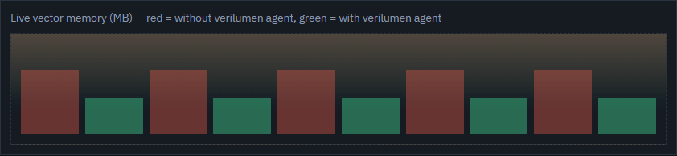

While patterns are being processed, this chart plots vector memory over time.

The red line (or area) grows as without the Verilumen agent (all patterns loading). The green line grows only for patterns the agent keeps. If green stays below red, the kept set is using less memory throughout the load process.

---

## 9. Final result banner

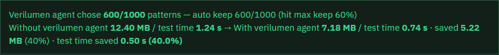

When the simulation completes, a green summary banner appears. It is the final scoreboard for that run.

It typically shows:

- how many patterns were kept out of the total (for example, 600 of 1000),  
- without-verilumen-agent memory and test time,  
- with-verilumen-agent memory and test time,  
- and how much memory and time were saved, including percentage savings.

This is the section most people look at first when explaining results to someone else.

---

## 10. High recommended vs low risk patterns

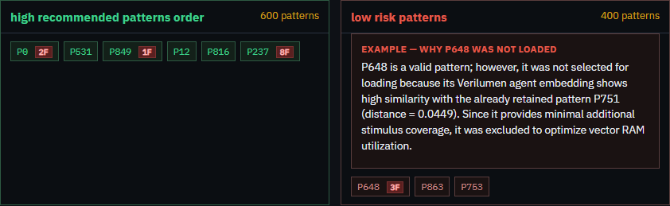

After the run, two lists appear side by side.

### High recommended patterns order (green)

These are the patterns Verilumen selected to keep in vector memory, shown in pick order. Each chip shows a pattern id such as P0 or P237.

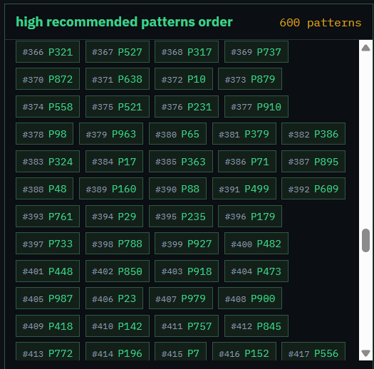

If you have already analyzed fail logs, a small red badge such as **8F** may appear on a chip. That means the pattern had 8 fails across the logs you provided.

### Low risk patterns (red)

These patterns were valid but not loaded. The agent skipped them to save memory and time, usually because they were too similar to a pattern already kept and would add little new coverage.

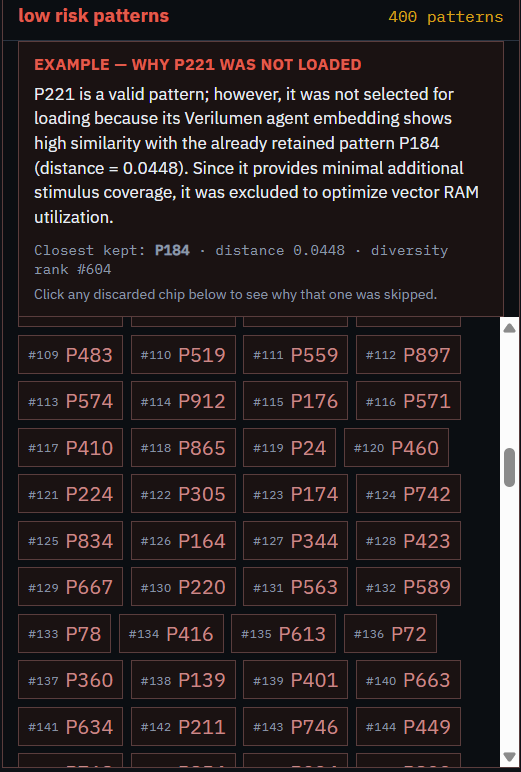

Click any low-risk chip to read a short explanation for that specific pattern — which kept pattern it was closest to, and the **embedding distance**. The panel also shows a **full 234-bit comparison** like the first-ten picker: **yellow** cells mark positions where the kept and not-loaded patterns differ.

---

## 11. Fail count analysis

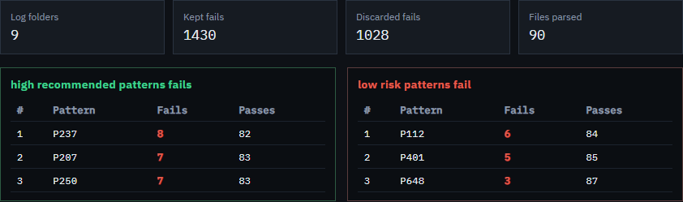

This section appears after you add log folders and run **Analyze fail counts**.

At the top, summary cards show how many log folders were used, total fails among kept patterns, total fails among discarded patterns, and how many files were read.

Below that, two tables list patterns with the highest fail counts:

- the left table is **high recommended patterns fails**,  
- the right table is **low risk patterns fail**.

Each row shows the pattern id, number of fails, and number of passes. Rows are ordered so the patterns with the most fails appear first. This helps you judge whether the agent kept the important failing patterns, and what risk exists among the low risk patterns.

---

## How to read the colors

The dashboard uses a simple color language:

- **Green** usually means Verilumen agent results, kept patterns, or savings.  
- **Blue** usually means without verilumen agent, low-risk / not-loaded patterns, or related counts.  
- **Yellow / gold** is used for progress, highlights, and bit differences.

---

## Practical notes

Always finish the live simulation before analyzing logs, because fail counts are matched against the kept and discarded lists from that run.

The log reader expects Advantest-style pattern execution logs, with lines such as pattern headers (`P12 | …`) and channel status (`STATUS:F` or `STATUS:P`).

In those logs, pattern labels are often numbered from 1 to 1000, while the dashboard uses Verilumen ids from 0 to 999. The tool maps them automatically (log P1 corresponds to dashboard P0, and so on).

If the page looks out of date after an update, refresh with **Ctrl+F5**.

---

*End of guide*
