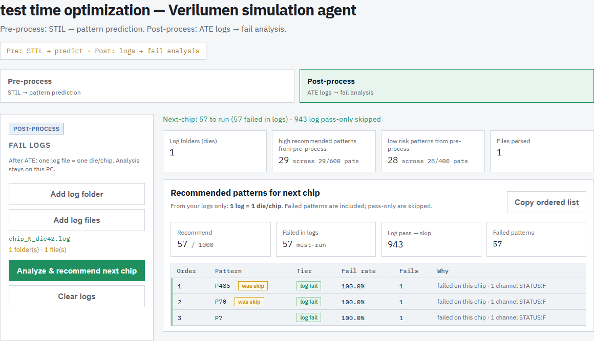
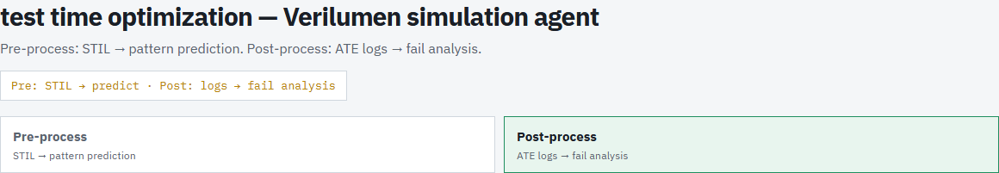
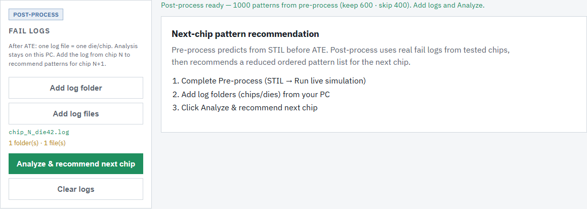
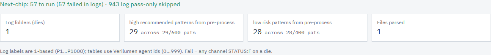
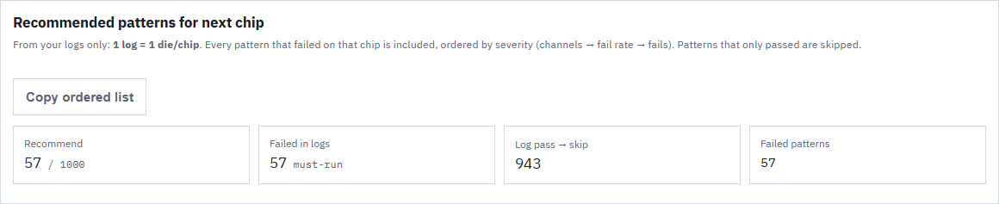
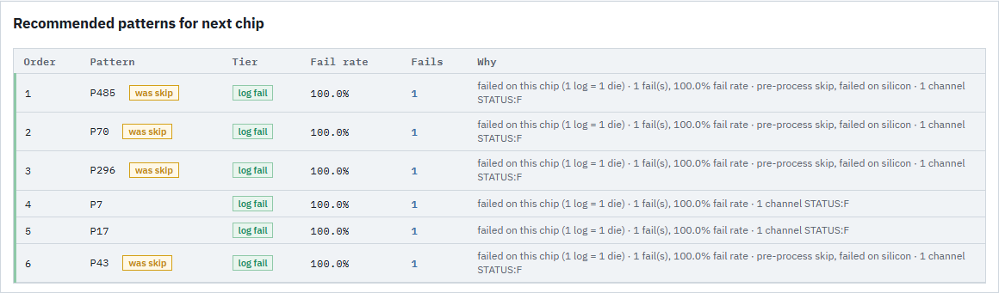

# Post-process User Guide  
## ATE log analysis → next-chip pattern recommendation

---

### About this guide

This document explains the **Post-process** window of the Verilumen dashboard.

Post-process is used **after** ATE testing. You take the fail log from **chip N** (one log = one die/chip), analyze which patterns failed, and get an **ordered list of patterns to run on chip N+1**.

It is separate from **Pre-process**, which only uses the STIL file to predict keep/skip before ATE.

Screenshots below match the Post-process dashboard layout. Sample numbers (e.g. 57 fails, keep 600) are examples; your counts depend on your STIL run and log.

---

### How Pre-process and Post-process fit together

| Stage | When | Input | Output |
|--------|------|--------|--------|
| **Pre-process** | Before ATE | STIL file | Keep / skip pattern lists (prediction) |
| **ATE** | On tester | Patterns loaded to vector memory | Fail/pass log for one die/chip |
| **Post-process** | After ATE | ATE log + last pre-process lists | Ordered patterns for **next chip** |

**Rule of thumb:** 1 ATE log file = 1 die = 1 chip.

---

### Recommended steps

1. Finish **Pre-process** (upload STIL → **Run live simulation** → wait until **Done**).  
2. Open the **Post-process** tab.  
3. Add the ATE log from the chip you just tested (**Add log file** or **Add log folder**).  
4. Click **Analyze & recommend next chip**.  
5. Review the summary cards and the **Recommended patterns for next chip** table.  
6. Optionally click **Copy ordered list** and use that order on the next chip.

Analysis runs **locally in your browser**. Log files stay on your PC and are not uploaded as a bulk transfer to the server.

---

## 1. Full Post-process page



The Post-process page has:

- **Header** — product title and Pre / Post switch  
- **Left panel** — add logs and run analysis  
- **Right / main area** — status, summary metrics, next-chip recommend table  

---

## 2. Switching to Post-process



Under the title are two tabs:

- **Pre-process** — STIL → pattern prediction (before ATE)  
- **Post-process** — ATE logs → fail analysis (after ATE)  

Click **Post-process** to open the log workflow. You need a finished pre-process run so the tool knows the full pattern set (keep + skip, usually 1000 patterns).

The yellow strip shows the high-level idea:

**Pre: STIL → predict · Post: logs → fail analysis**

---

## 3. Left panel — Fail logs



This panel controls log input.

### Post-process tag

Green/blue tag **Post-process** marks that you are in the after-ATE stage.

### Add log folder

Use this when logs sit in a folder (e.g. one folder per die). You can add more than one folder over time.

### Add log files

Use this to pick one or more `.log` / `.txt` files directly.  
For the usual flow (**1 chip → 1 log**), adding a **single log file** is enough.

### File list

After you select files, the panel shows file/folder names and a count such as:

`1 folder(s) · 1 file(s)`

### Analyze & recommend next chip

Runs:

1. Parse pass/fail (and channel `STATUS:F`) from the log  
2. Match patterns to the last pre-process keep/skip lists  
3. Build the **next-chip ordered recommend list**

### Clear logs

Removes selected logs and clears the current analysis so you can start over.

### Empty main area (before Analyze)

Until you analyze, the main pane shows a short checklist:

1. Complete Pre-process  
2. Add log folders/files  
3. Click **Analyze & recommend next chip**

Status may also say that post-process is ready and how many patterns came from pre-process (e.g. keep 600 · skip 400 out of 1000). That is **context only** — analysis still uses **all** patterns, not only the keep list.

---

## 4. Status line and summary cards (after Analyze)



### Status line

Example:

> Next-chip: 57 to run (57 failed in logs) · 943 log pass-only skipped

Meaning:

- **57 to run** — patterns recommended for the next chip  
- **failed in logs** — patterns that had at least one fail on this chip  
- **log pass-only skipped** — patterns that only passed in this log (not recommended)

### Summary cards

| Card | Meaning |
|------|---------|
| **Log folders (dies)** | How many die/chip keys were found (1 file → usually **1**) |
| **high recommended patterns from pre-process** | Fail count among patterns Pre-process **kept** (e.g. 29 fails across 29/600 patterns) |
| **low risk patterns from pre-process** | Fail count among patterns Pre-process **skipped** (e.g. 28 fails across 28/400 patterns) |
| **Files parsed** | How many log files were read |

These two “high recommended / low risk” cards compare silicon fails against the **pre-process split**. They do **not** limit the next-chip list to keep-only patterns. A skip pattern that failed on silicon can still be recommended (shown later with a **was skip** badge).

### ID note

Advantest-style logs often use **P1…P1000** (1-based). The dashboard uses Verilumen ids **0…999**. The tool maps `log Pn → pattern id n−1`.  
A fail means any channel line with **STATUS:F** for that pattern on the die.

---

## 5. Recommended patterns — header and metrics



### Title

**Recommended patterns for next chip** — this is the main deliverable of Post-process.

### Short help text

- **1 log = 1 die/chip**  
- Every pattern that **failed** on that chip is included  
- Order by severity: **channels → fail rate → fails**  
- Patterns that **only passed** are skipped  

### Copy ordered list

Copies pattern ids in run order (e.g. `P485, P70, P296, …`) to the clipboard for use on the next chip / ATE load list.

### Recommend metrics

| Metric | Meaning |
|--------|---------|
| **Recommend** | How many patterns to run next / total patterns (e.g. 57 / 1000) |
| **Failed in logs** | How many of those are must-run because they failed on this chip |
| **Log pass → skip** | How many patterns only passed and are not recommended |
| **Failed patterns** | How many patterns failed in the log and are recommended (e.g. 57) |

---

## 6. Recommend table (ordered list)



Each row is one pattern to consider for the **next chip**, in suggested run order.

### Columns

| Column | Meaning |
|--------|---------|
| **Order** | Run priority (1 = run first) |
| **Pattern** | Pattern id (e.g. P485). Badge **was skip** = Pre-process had put it in the low-risk skip list, but it still failed on silicon |
| **Tier** | Why it was included. **log fail** = failed in the ATE log (always included) |
| **Fail rate** | `fails ÷ (fails + passes)` on the analyzed log(s). With **one die**, a failer is usually **100%** (1 fail, 0 pass) |
| **Fails** | Number of fail events counted for that pattern |
| **Why** | Short human-readable reasons (chip fail, channel hits, pre-process skip note, etc.) |

### How order is decided (1 log = 1 die)

Among patterns that failed:

1. More failing **channels** first  
2. Then higher **fail rate**  
3. Then more **fails**  
4. Then tie-breaks (including model score / pattern id)

If many rows look identical (all 100% fail rate, 1 fail, 1 channel), they are effectively a **tie** — order among them is not a strong severity difference.

### What “was skip” means

- Pre-process said this pattern was **low risk** and could be skipped for memory/time.  
- The ATE log showed it **failed** on this chip.  
- Post-process **promotes** it into the next-chip list.  

That is the feedback loop: STIL prediction corrected by silicon evidence.

### What is **not** in this table

Patterns that **only passed** on this chip are **skipped for next chip** (see **Log pass → skip**). They are not listed here.

---

## 7. What Post-process does (logic summary)

```text
Chip N ATE log
      │
      ▼
Parse each pattern: pass / fail / channel STATUS:F
      │
      ├── Failed ≥ 1 time  →  INCLUDE (order by severity)
      └── Passed only      →  SKIP for next chip
      │
      ▼
Ordered list → run on Chip N+1
```

### Fail rate = 100% on one die

With one chip:

```text
fail rate = fails / (fails + passes) = 1 / (1 + 0) = 100%
```

That means “failed on this chip,” not “fails on every chip forever.”  
With multiple die logs, the same pattern can show a rate below 100% if it passed on some dies and failed on others.

---

## 8. Tips and common questions

**Do I need Pre-process first?**  
Yes. Post-process uses the keep/skip pattern universe from the last live simulation.

**Does Post-process only use the keep 600?**  
No. It uses **all** patterns (keep + skip). The summary cards only report fails split by that pre-process label.

**Why is the recommend count much smaller than 1000?**  
Because only patterns that **failed** on the analyzed chip are recommended. Pass-only patterns are skipped to reduce next-chip test time.

**Are log files uploaded?**  
Parsing runs in the browser on your PC. Files stay local.

**Expected log format**  
Advantest-style lines such as:

```text
P12 | CH3 ...
STATUS:F
```

or `STATUS:P` for pass.

---

## 9. Quick checklist

| Step | Action |
|------|--------|
| 1 | Pre-process: STIL → Run live simulation → Done |
| 2 | Open **Post-process** |
| 3 | **Add log files** (1 log = 1 die) |
| 4 | **Analyze & recommend next chip** |
| 5 | Read summary cards (high recommended / low risk fails from pre-process) |
| 6 | Use **Recommended patterns for next chip** table order |
| 7 | **Copy ordered list** for the next chip run |

---

*Document location: `docs/POST_PROCESS_GUIDE.md`*  
*Screenshots: `docs/images/post-*.png`*  
*Demo page used for captures: `docs/demo-post-process.html`*
